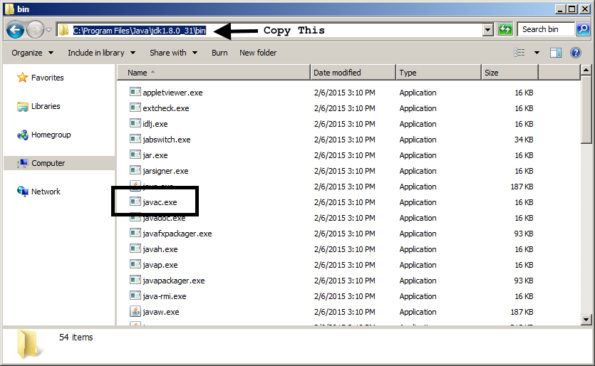
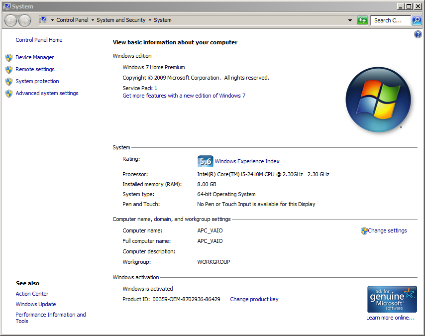
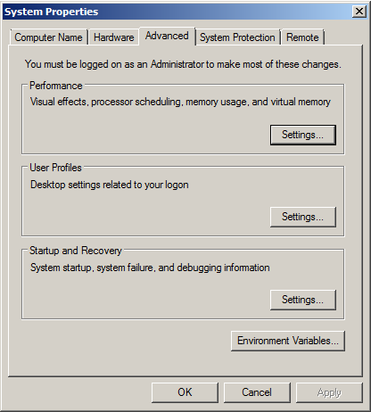
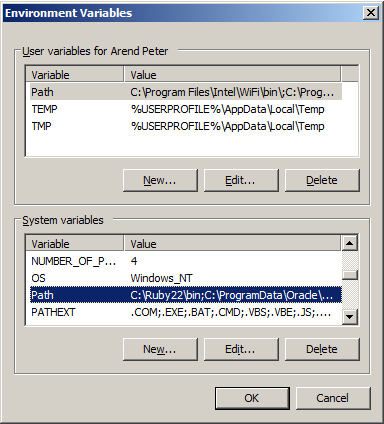
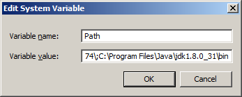
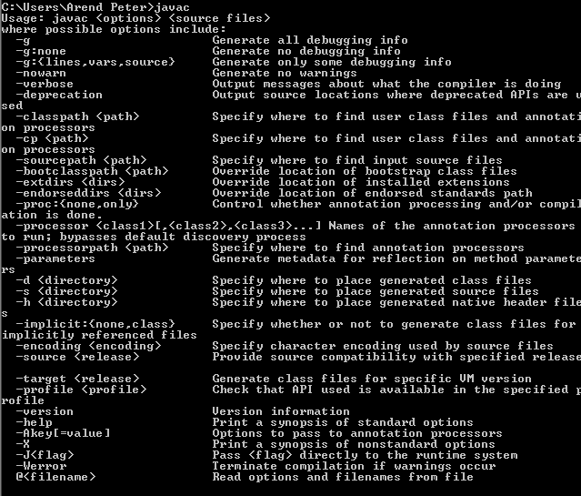

To start out with we’ll be installing Java and adding it to our path so that we can access it from the command line.

# 1.1 Windows Setup

## 1.1.1 Downloading and Installing Java
Here is a link to a download to the most current version of Java at the time of creating this document.
[Oracle Download Page](http://www.oracle.com/technetwork/java/javase/downloads/jdk8-downloads-2133151.html)
If this is outdated the download can be found by searching for “Java JDK” and the download area should be the first result.
Once it’s downloaded click next through the download process and be sure to make note of the directory in which it’s installed. Screen shots of the entire installation process can be found in Appendix A

## 1.1.2 Adding Java to Path
Open up command prompt. This can be done by typing “cmd” in your search bar. Now we’re going to test if the Java compiler is linked to your path. To do this input `javac`.

If your output looks similar to this then it hasn’t been added to your path yet.
To add Java to you path. Start by going to the directory where you installed it using file explorer, navigate to the bin directory, and then copy the path. You’ll know you’re in the right directory because there’ll be a file called “javac.exe” in the directory.

Next go to your search menu and look for “System”, and open it.

Next click on Advaced system settings

**Warning: Be sure to follow the next steps exactly as incorrectly modifying your path could affect other areas on your computer**

Next click “Environment Variables…”

Now look under the “System variables” section, select “Path”, then click “Edit…”

Add a semi-colon to the previous path, then paste the Java installation directory, which was copied earlier. Also make sure there is no whitespace at the end of your path.
Hit ok on all the open windows to back out of this area and to apply your changes.
Next close your original command prompt window and open a new one. Now when you type `javac` it should give you a list of options indicating how this command is intended to be used as can be seen in figure 1.1.

**Figure 1.1** Output by `javac` once Java is installed

## 1.1.3 Command Prompt Basics

In this document we’ll be using the command prompt to run our programs. Many people prefer to use IDEs such as Eclipse or NetBeans for running their programs however since command prompt is the most universally available and since it exposes you to all details of the process command prompt is preferred for this guide.

For this guide there are about 9 commands you’ll need for basic command prompt usage

| cd ..            | Navigate up a directory |
| cd <directory>   | Navigate down to a specific directory |
| dir              | List all files and directories in current directory|  
| cls				       | Clear the screen |
| help				     | Lists all command prompt commands |
| help <command>   | Lists the usage for a specific command |
| java				     | Run a java program |
| javac				     | Compile a java program |
| color				     | Change the color of your screen |

**Figure 1.2** List of basic command prompt commands

The last one isn’t really essential but it’s just fun to use. For example inputting `color 70` will invert the colors on your command prompt window.
As an example of navigating through directories in Figure 1.3 I’ve used `dir` to see what’s in my directory. I saw “Desktop” in that list so I used `cd Desktop` to navigate to my desktop. Then I used `cd ..` to go back to my user directory.

**Figure 1.1** Example of navigating within command prompt
