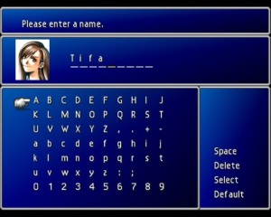
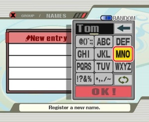

## 3.1.1 Use of Variables

Variables are names that we can assign to values (these values can be numbers but they could be other things as well). The main benefit to using variables is that if we need to make changes we can adjust that variable rather than change the value whenever it's used.

For example if you were to write a story the same name would come up a lot

> **Catherine** is the main character in this sample story. She is a very brave character and **Catherine** is her name. She has two dogs and she named them both **Catherine** because it's easier that way.

If the name needed to be changed you can imagine that it would be very tedious to adjust all the places where the name is used. This is why we would create a variable called name, assign a value to the variable, and then reference the variable every time we need the name.

> **mainCharacterName = Catherine**

> **mainCharacterName** is the main character in this sample story. She is a very brave character and **mainCharacterName** is her name. She has two dogs and she name them both **mainCharacterName** because it's easier that way.

This specific application of variables is used in a lot of video games.

Aside from that there are tons of practical situations when you'd want to use variables in code. Websites have variables to represent your user name, your phone has a variable representing what it's battery life is and if you ever change a setting in any program there's a variable behind the scenes that's being updated.

## 3.1.2 Basic Syntax

This is what the syntax would look like if we wanted to assign the value **Catherine** to a variable called **name**.

~~~java
String mainCharacterName = "Catherine";
~~~

Next we'll break down the individual sections.

`String` is the variable *type*. Depending on what your variable needs to be able to store you would need to adjust the type accordingly. Since we're storing text, `String` is the type you'll want to use. We'll talk more about all the available types later in this chapter.

`mainCharacterName` is the variable *name*. Aside from some specific rules you can name the variables whatever you want. I'll be following some general Java conventions when naming my variables. There are several conventions but generally we have class names start with an uppercase letter and we have normal variable names start with a lowercase letter. Keep in mind that these conventions aren't enforced by Java, they're just the way that people have tended to name their variables. The more important aspect is that your variable names should be a good description of the data that it contains. Since our early projects will be fairly small good variable names won't be as important so feel free to call them whatever makes the most sense to you.

<u>Rules for Variable Naming</u>

* Only letters, digits, underscore `_` , and dollar sign `$`  
* Note that as with all things in Java, variable names are case sensitive
* Variable names may not start with a digit
* Reserved Java keywords (class, void, static, etc.) may not be used as variable names

`=` is called the *Assignment Operator*. You could think of it like the equality symbol from math in that both sides become equal but the functionality isn't exactly the same. The assignment operator takes the data on the right and stores it in the variable on the left.

`"Catherine"` is the data that's assigned to the variable. As mentioned in section 2.2, the double quotes `" "` are necessary to indicate that `Catherine` should be interpreted as text rather than code.

`;` indicates the end of the statement. Semi-colons must be placed at the end of each of your statements. You can think of it as being synonymous to the period in English, in that the semi-colon indicates when a thought has be completed and this allows the computer to break up the program into understandable pieces in the same way that a period helps to break up our words into sentences. The forgetting (or the improper addition) of semi-colons will account for the majority of your early errors, but the constant error messages will help you learn quick.  
